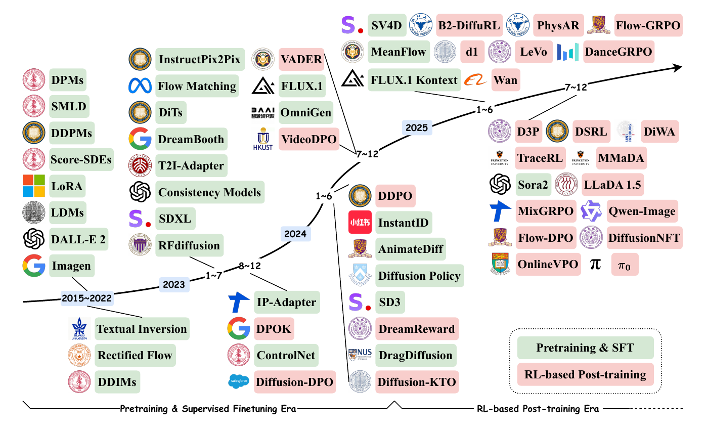

# Reinforcement Learning-driven Diffusion Models: Language, Vision, and Beyond
<!--  -->
> This repository tracks research on reinforcement learning-driven diffusion models, accompanying the survey **Reinforcement Learning-driven Diffusion Models: Language, Vision, and Beyond**. It focuses on how RL, reward modeling, preference optimization, and policy-gradient post-training reshape diffusion models from purely data-driven generators into goal-directed systems across language, vision, multimodal generation, robotics, and scientific discovery.

  

---

## Contents

1. [Reinforcement Learning for Diffusion Large Language Models](#reinforcement-learning-for-diffusion-large-language-models)
2. [Reinforcement Learning for Diffusion Vision Models](#reinforcement-learning-for-diffusion-vision-models)
3. [Reinforcement Learning for Diffusion Multimodal Models](#reinforcement-learning-for-diffusion-multimodal-models)
4. [Reinforcement Learning for Diffusion Robotics](#reinforcement-learning-for-diffusion-robotics)
5. [Reinforcement Learning for Diffusion Science Models](#reinforcement-learning-for-diffusion-science-models)
6. [Contributing](#contributing)
---
<!-- Paper 列使用 arXiv 徽章：https://img.shields.io/badge/paper-A42C25?style=for-the-badge&logo=arxiv&logoColor=white
<!--  -->
<!--  -->
<!-- Code 列使用 GitHub Star 徽章：https://img.shields.io/github/stars/{owner}/{repo}?style=for-the-badge&logo=github&label=GitHub&color=black --> 

## Paper List

### Reinforcement Learning for Diffusion Large Language Models

Works on diffusion-based language models and post-training methods that treat masking, unmasking, or denoising trajectories as optimization targets. This section covers reasoning alignment, RLVR/GRPO-style training, reward guidance, efficient inference, and foundational diffusion language modeling.

|  Date   |      Name      | Title                                                        | Paper                                                        | Code                                                         |
| :-----: | :------------: | ------------------------------------------------------------ | ------------------------------------------------------------ | ------------------------------------------------------------ |
| 2026-07 | `Mask-Aware PG` | Mask-Aware Policy Gradients for Diffusion Language Models |  |  |
| 2026-07 | `SLIM-RL` | SLIM-RL: Risk-Budgeted Random-Masking RL for Diffusion LLMs Without Trajectory Slicing |  |  |
| 2026-07 | `AG-GRPO` | AG-GRPO: Answer-Guided GRPO for Masked Diffusion Language Models |  | - |
| 2026-07 | `TOPD` | Trace-Based On-Policy Distillation for Masked Diffusion Language Models |  | - |
| 2026-07 | `dOPSD` | dOPSD: On-Policy Self-Distillation for Diffusion Language Models |  | - |
| 2026-07 | Survey | Accelerating Masked Diffusion Large Language Models: A Survey of Efficient Inference Techniques |  | - |
| 2026-06 | `CAPR` | Read the Trace, Steer the Path: Trajectory-Aware Reinforcement Learning for Diffusion Language Models |  |  |
| 2026-05 | `RLDF` | Reinforcement Learning from Denoising Feedback |  |  |
| 2026-05 | `GDSD` | GDSD: Reinforcement Learning as Guided Denoiser Self-Distillation for Diffusion Language Models |  |  |
| 2026-04 | `DARE` | DARE: Diffusion Large Language Models Alignment and Reinforcement Executor |  |  |
| 2026-03 | `StableDRL` | Stabilizing Reinforcement Learning for Diffusion Language Models |  |  |
| 2026-01 | `JustGRPO` | The Flexibility Trap: Rethinking the Value of Arbitrary Order in Diffusion Language Models |  |  |
| 2025-12 | `dUltra` | dUltra: Ultra-Fast Diffusion Language Models via Reinforcement Learning |  |  |
| 2025-12 | `d-TreeRPO` | d-TreeRPO: Towards More Reliable Policy Optimization for Diffusion Language Models |  |  |
| 2025-12 | `ESPO` | Principled RL for Diffusion LLMs Emerges from a Sequence-Level Perspective |  |  |
| 2025-12 | `DiRL` | DiRL: An Efficient Post-Training Framework for Diffusion Language Models |  |  |
| 2025-10 | `BGPO` | Boundary-Guided Policy Optimization for Memory-Efficient RL of Diffusion Large Language Models |  |  |
| 2025-10 | `SPG` | SPG: Sandwiched Policy Gradient for Masked Diffusion Language Models |  |  |
| 2025-10 | `GDPO` | Improving Reasoning for Diffusion Language Models via Group Diffusion Policy Optimization |  |  |
| 2025-10 | `DMPO` | Enhancing Reasoning for Diffusion LLMs via Distribution Matching Policy Optimization |  |  |
| 2025-10 | `DiFFPO`            | DiFFPO: Training Diffusion LLMs to Reason Fast and Furious via Reinforcement Learning |  | - |
| 2025-10 | `AGRPO` | Principled and Tractable RL for Reasoning with Diffusion Language Models |  | - |
| 2025-10 | `SAPO-LLaDA` | Step-Aware Policy Optimization for Reasoning in Diffusion Large Language Models |  | - |
| 2025-10 | `MRO` | MRO: Enhancing Reasoning in Diffusion Language Models via Multi-Reward Optimization |  |  |
| 2025-09 | `TraceRL` (`TraDo`) | Revolutionizing Reinforcement Learning Framework for Diffusion Large Language Models |  |    |
| 2025-09 | `RFG` | RFG: Test-Time Scaling for Diffusion Large Language Model Reasoning with Reward-Free Guidance |  | - |
| 2025-09 | `IGPO` | Inpainting-Guided Policy Optimization for Diffusion Large Language Models |   | - |
| 2025-08 |    `LLaDA`     | Large Language Diffusion Models                              |  |  |
| 2025-08 | `MDPO` | MDPO: Overcoming the Training-Inference Divide of Masked Diffusion Language Models |  |  |
| 2025-08 | Survey | A Survey on Diffusion Language Models |  |  |
| 2025-07 | `wd1` | wd1: Weighted Policy Optimization for Reasoning in Diffusion Language Models |  |  |
| 2025-06 |   `DLM-One`    | DLM-One: Diffusion Language Models for One-Step Sequence Generation |  | - |
| 2025-06 | `DiffuCoder`        | DiffuCoder: Understanding and Improving Masked Diffusion Models for Code Generation |  |  |
| 2025-06 | Survey | Discrete Diffusion in Large Language and Multimodal Models: A Survey |  |  |
| 2025-05 | `DCoLT`        | Reinforcing the Diffusion Chain of Lateral Thought with Diffusion Language Models |  |  |
| 2025-05 | `LLaDA 1.5` | LLaDA 1.5: Variance-Reduced Preference Optimization for Large Language Diffusion Models |  |  |
| 2025-04 | `d1` | d1: Scaling Reasoning in Diffusion Large Language Models via Reinforcement Learning |  |  |
| 2025-02 | `SEPO` | Fine-Tuning Discrete Diffusion Models with Policy Gradient Methods |  |  |
| 2024-09 |     `DoT`      | Diffusion of Thought: Chain-of-Thought Reasoning in Diffusion Language Models |  | - |
| 2023-10 | `DiffuSeq-v2`  | DiffuSeq-v2: Bridging Discrete and Continuous Text Spaces for Accelerated Seq2Seq Diffusion Models |  |  |
| 2023-05 |   `DiffuSeq`   | DiffuSeq: Sequence to Sequence Text Generation with Diffusion Models |  |  |
| 2023-03 | Survey | Diffusion Models for Non-autoregressive Text Generation: A Survey |  | - |
| 2022-11 |     `SED`      | Self-conditioned Embedding Diffusion for Text Generation     |  | - |
| 2022-05 | `Diffusion-LM` | Diffusion-LM Improves Controllable Text Generation           |  |  |

---

### Reinforcement Learning for Diffusion Vision Models

Research on aligning image, video, audio, and 3D diffusion or flow models with human preferences and task-specific rewards. Topics include RLHF/RLAIF, reward backpropagation, DPO/KTO/GRPO variants, safety, physical consistency, world consistency, editing, and controllable generation.

| Date   | Name        | Title                                                                 | Paper | Code |
|:------:|:-----------:|-----------------------------------------------------------------------|-------|------|
| 2026-09 | `WorldReward` | WorldReward: Reward Modeling for Camera-Conditioned World Models |  |  |
| 2026-08 | `VIBE` | VIBE: Video Instruction-aligned Background Music Generation |  |  |
| 2026-08 | `DGCR` | Test-Time Scaling for Video Diffusion Models via Diagnosis-Guided Candidate Recycling |  |  |
| 2026-08 | `DDSynth-RL` | Audio Synthesizer Inversion via Discrete Diffusion with Reinforcement Learning |  |  |
| 2026-08 | `RVM` | Scaling Reinforcement Learning for Diffusion Models via Velocity Matching |  | - |
| 2026-07 | `JAGG` | Jacobian-Aggregated Group Gradient for Efficient GRPO Training of Diffusion Models |  |  |
| 2026-07 | `MeanFlowNFT` | MeanFlowNFT: Bringing Forward-Process RL to Average-Velocity Generators |  |  |
| 2026-06 | `Flow-DPPO` | Flow-DPPO: Divergence Proximal Policy Optimization for Flow Matching Models |  |  |
| 2026-06 | `Qwen-Image-2.0-RL` | Qwen-Image-2.0-RL Technical Report |  | - |
| 2026-05 | `RTDMD` | Reinforcing Few-Step Generators via Reward-Tilted Distribution Matching |  |  |
| 2026-05 | `DRM` | DRM: Diffusion-Based Reward Model With Step-Wise Guidance |  |  |
| 2026-05 | `AdvantageFlow` | Advantage-Weighted Least Squares for RL in Flow Models |  |  |
| 2026-05 | `Precise` | SDE-Consistent Stochastic Sampling for RL Post-Training of Flow-Matching Models |  |  |
| 2026-05 | `SafeDiffusion-R1` | Online Reward Steering for Safe Diffusion Post-Training |  |  |
| 2026-05 | `Flow-OPD` | On-Policy Distillation for Flow Matching Models |  |  |
| 2026-05 | `Diffusion LAIR` | Beyond Pairwise Preferences: Listwise Reward-Aware Alignment for Diffusion Models |  | - |
| 2026-04 | `V-GRPO` | V-GRPO: Online Reinforcement Learning for Denoising Generative Models Is Easier Than You Think |  |  |
| 2026-04 | `MAR-GRPO` | Stabilized GRPO for AR-Diffusion Hybrid Image Generation |  |  |
| 2026-04 | `World-R1` | World-R1: Reinforcing 3D Constraints for Text-to-Video Generation |  |  |
| 2026-03 | `GDPO-SR` | Group Direct Preference Optimization for One-Step Generative Image Super-Resolution |  |  |
| 2026-03 | `TDM-R1` | Reinforcing Few-Step Diffusion Models with Non-Differentiable Reward |  |  |
| 2026-03 | `VGGRPO` | VGGRPO: Towards World-Consistent Video Generation with 4D Latent Reward |  | - |
| 2026-03 | Survey | Advances in GRPO for Generation Models: A Survey |  | - |
| 2026-02 | `Flow-Factory` | A Unified Framework for Reinforcement Learning in Flow-Matching Models |  |  |
| 2026-02 | `PromptRL` | Prompt Matters in RL for Flow-Based Image Generation |  |  |
| 2026-01 | `Local-DPO` | Mind the Generative Details: Direct Localized Detail Preference Optimization for Video Diffusion Models |  |  |
| 2025-12 | `RealGen` | Photorealistic Text-to-Image Generation via Detector-Guided Rewards |  |  |
| 2025-11 | `VANS` | Video-as-Answer: Predict and Generate Next Video Event with Joint-GRPO |  |  |
| 2025-10 | `DGPO` | Reinforcing Diffusion Models by Direct Group Preference Optimization |  |  |
| 2025-10 | `G2RPO` | Fine-Grained GRPO for Precise Preference Alignment in Flow Models |  |  |
| 2025-09 | `AWM` | Advantage Weighted Matching: Aligning RL with Pretraining in Diffusion Models |  |  |
| 2025-09 | `DiffusionNFT` | DiffusionNFT: Online Diffusion Reinforcement with Forward Process |  |  |
| 2025-09 | `BranchGRPO` | Stable and Efficient GRPO with Structured Branching in Diffusion Models |  |  |
| 2025-09 | `Flow-CPS` | Coefficients-Preserving Sampling for Reinforcement Learning with Flow Matching |  |  |
| 2025-08 | `RLG` | Inference-Time Alignment Control for Diffusion Models with Reinforcement Learning Guidance |  |  |
| 2025-08 | Survey | Integrating Reinforcement Learning with Visual Generative Models: Foundations and Advances |  | - |
| 2025-07 | `MixGRPO` | MixGRPO: Unlocking Flow-Based GRPO Efficiency with Mixed ODE-SDE Trajectories |  |  |
| 2025-05 | `DanceGRPO` | DanceGRPO: Unleashing GRPO on Visual Generation                      |  |  |
| 2025-05 | `Flow-GRPO` | Flow-GRPO: Training Flow Matching Models via Online RL               |  |  |
| 2025-05 | `Pref-GRPO` | Pref-GRPO: Pairwise Preference Reward-based GRPO for Stable Text-to-Image RL |  | |
| 2025-05 | Survey | Alignment and Safety of Diffusion Models via Reinforcement Learning and Reward Modeling: A Survey |  | - |
| 2025-05 | `T2I-R1` | T2I-R1: Reinforcing Image Generation with Collaborative Semantic-Level and Token-Level CoT |  |  |
| 2024-12 | `Video-DPO` | VideoDPO: Omni-Preference Alignment for Video Diffusion Generation   |  |  |
| 2024-12 | `OnlineVPO` | OnlineVPO: Align Video Diffusion Model with Online Video-Centric Preference Optimization |  | - |
| 2024-10 | `T2V-Turbo-v2` | T2V-Turbo-v2: Enhancing Video Generation Model Post-Training through Data, Reward, and Conditional Guidance Design |  |  |
| 2024-07 | `VADER` | Video Diffusion Alignment via Reward Gradients |  | - |
| 2024-04 | `Diffusion-KTO` | Aligning Diffusion Models by Optimizing Human Utility |  |  |
| 2024-02 | `Dense-Reward-T2I` | A Dense Reward View on Aligning Text-to-Image Diffusion with Preference |  |  |
| 2023-11 | `Diffusion-DPO` | Diffusion Model Alignment Using Direct Preference Optimization |  |  |
| 2023-10 | `AlignProp` | Aligning Text-to-Image Diffusion Models with Reward Backpropagation |  |  |
| 2023-09 | `DRaFT` | Directly Fine-Tuning Diffusion Models on Differentiable Rewards |  | - |
| 2023-05 | `DPOK`     | DPOK: Reinforcement Learning for Fine-tuning Text-to-Image Diffusion Models |  |  |
| 2023-05 | `DDPO` | Training Diffusion Models with Reinforcement Learning |  |  |
| 2023-04 | `ImageReward` | ImageReward: Learning and Evaluating Human Preferences for Text-to-Image Generation |  |  |
| 2023-02 | `RLHF-T2I` | Aligning Text-to-Image Models using Human Feedback |  | - |

---

### Reinforcement Learning for Diffusion Multimodal Models

Unified multimodal diffusion and reward-model research where language, vision, audio, and generation are optimized together. This section highlights multimodal reward modeling, visual reasoning rewards, unified image-text generation, and RL post-training for UMMs and diffusion MLLMs.

| Date   | Name            | Title                                                              | Paper | Code |
|:------:|:---------------:|--------------------------------------------------------------------|-------|------|
| 2026-08 | `VA-Judger` | Reward Modeling from Human Preference Feedback for Joint Video-Audio Generation |  |  |
| 2026-07 | `SpectraReward` | Read It Back: Pretrained MLLMs Are Zero-Shot Reward Models for Text-to-Image Generation |  | - |
| 2026-05 | `AlphaGRPO` | AlphaGRPO: Unlocking Self-Reflective Multimodal Generation in UMMs via Decompositional Verifiable Reward |  |  |
| 2026-05 | `DeScore` | Think, then Score: Decoupled Reasoning and Scoring for Video Reward Modeling |  |  |
| 2026-03 | `MSRL` | MSRL: Scaling Generative Multimodal Reward Modeling via Multi-Stage Reinforcement Learning |  |  |
| 2026-03 | `UniGRPO` | UniGRPO: Unified Policy Optimization for Reasoning-Driven Visual Generation |  | - |
| 2026-02 | `LaViDa-R1` | LaViDa-R1: Advancing Reasoning for Unified Multimodal Diffusion Language Models |  | - |
| 2025-12 | `ARM-Thinker` | ARM-Thinker: Reinforcing Multimodal Generative Reward Models with Agentic Tool Use and Visual Reasoning |  |  |
| 2025-12 | `ParaUni` | ParaUni: Enhance Generation in Unified Multimodal Model with Reinforcement-driven Hierarchical Parallel Information Interaction |  |  |
| 2025-11 | `MMaDA-Parallel` | MMaDA-Parallel: Multimodal Large Diffusion Language Models for Thinking-Aware Editing and Generation |  |  |
| 2025-10 | `UniRL-Zero` | UniRL-Zero: Reinforcement Learning on Unified Models with Joint Language Model and Diffusion Model Experts |  |  |
| 2025-09 | `Skywork UniPic 2.0` | Skywork UniPic 2.0: Building Kontext Model with Online RL for Unified Multimodal Model |  |  |
| 2025-08 | `OneReward` | OneReward: Unified Mask-Guided Image Generation via Multi-Task Human Preference Learning |  |  |
| 2025-08 | `MMaDA`         | MMaDA: Multimodal Large Diffusion Language Models                 |  |  |
| 2025-08 | `LLaDA-V`       | LLaDA-V: Large Language Diffusion Models with Visual Instruction Tuning |  |  |
| 2025-08 | Survey | Reinforcement Learning for Large Model: A Survey |  | - |
| 2025-05 | `R1-Reward`     | R1-Reward: Training Multimodal Reward Model Through Stable RL      |  |  |
| 2025-05 | `UnifiedReward-Think` | Unified Multimodal Chain-of-Thought Reward Model through Reinforcement Fine-Tuning |  |  |
| 2025-03 | `UnifiedReward` | Unified Reward Model for Multimodal Understanding and Generation   |  |  |

---

### Reinforcement Learning for Diffusion Robotics

Diffusion and flow policies studied as decision-making systems for robotics, planning, offline and online RL, and VLA post-training. The listed work emphasizes reward- or value-guided action generation, policy refinement, world-model interaction, and deployment under real-world control constraints.

| Date   | Name   | Title                                                               | Paper | Code |
|:------:|:------:|---------------------------------------------------------------------|-------|------|
| 2026-09 | `Facet-0` | Facet-0: A Robotic Foundation Model for Contact-Rich Precise Manipulation |  |  |
| 2026-08 | `RoMAN-Flow` | RoMAN-Flow: Taming Autoregressive Normalizing Flows for Offline Reinforcement Learning in Robotic Manipulation |  |  |
| 2026-08 | `StructRL` | StructRL: Structured Action-Space Exploration for Flow-Based VLAs |  |  |
| 2026-08 | `RynnValue` | RynnValue: Scaling Robotic Value Foundation Models with Temporal Distance |  |  |
| 2026-07 | `WCM` | WCM: A World Critic Model for Vision-Language-Action Reinforcement Learning |  |  |
| 2026-07 | `X-NavDP` | X-NavDP: Generalizing Navigation Diffusion Policy to Novel Behavior and Embodiments with Group Q-Score Reweighted Matching |  |  |
| 2026-07 | `VINE` | VINE: Taming Generative Control Policies for Reinforcement Learning |  | - |
| 2026-06 | `dVLA-RL` | dVLA-RL: Reinforcement Learning over Denoising Trajectories for Discrete Diffusion Vision-Language-Action Models |  | - |
| 2026-06 | `MODIP` | MODIP: Efficient Model-Based Optimization for Diffusion Policies |  | - |
| 2026-05 | `CGPO` | Sample-Efficient Diffusion-Based Reinforcement Learning with Critic Guidance |  |  |
| 2026-04 | `ViVa` | ViVa: A Video-Generative Value Model for Robot Reinforcement Learning |  |  |
| 2026-04 | `DBPO` | Drift-Based Policy Optimization: Native One-Step Policy Learning for Online Robot Control |  |  |
| 2026-03 | `FlowRL` | FlowRL: A Taxonomy and Modular Framework for Reinforcement Learning with Diffusion Policies |  |  |
| 2026-03 | `VLA-MBPO` | Towards Practical World Model-Based Reinforcement Learning for Vision-Language-Action Models |  |  |
| 2026-01 | Survey | A Review of Online Diffusion Policy RL Algorithms for Scalable Robotic Control |  | - |
| 2025-11 | `ProphRL` | Reinforcing Action Policies by Prophesying |  |  |
| 2025-11 | `WMPO` | WMPO: World Model-Based Policy Optimization for Vision-Language-Action Models |  |  |
| 2025-11 | `DIVO` | Diffusion Policies with Value-Conditional Optimization for Offline Reinforcement Learning |  | - |
| 2025-10 | `RL-100` | RL-100: Performant Robotic Manipulation with Real-World Reinforcement Learning |  |  |
| 2025-10 | `RLinf-VLA` | RLinf-VLA: A Unified and Efficient Framework for Reinforcement Learning of Vision-Language-Action Models |  |  |
| 2025-10 | `VLA-RFT` | VLA-RFT: Vision-Language-Action Reinforcement Fine-Tuning with Verified Rewards in World Simulators |  |  |
| 2025-10 | `πRL` | πRL: Online RL Fine-tuning for Flow-based Vision-Language-Action Models |  | - |
| 2025-10 | Survey | Diffusion Models for Reinforcement Learning: Foundations, Taxonomy, and Development |  | - |
| 2025-09 | `World-Env` | World-Env: Leveraging World Model as a Virtual Environment for VLA Post-Training |  |  |
| 2025-09 | `VLAC` | A Vision-Language-Action-Critic Model for Robotic Real-World Reinforcement Learning |  |  |
| 2025-09 | `SimpleVLA-RL` | SimpleVLA-RL: Scaling VLA Training via Reinforcement Learning |  |  |
| 2025-09 | `DreamControl`| DreamControl: Human-Inspired Whole-Body Humanoid Control for Scene Interaction via Guided Diffusion|   | - |
| 2025-09 | - | Beyond Human Demonstrations: Diffusion-Based Reinforcement Learning to Generate Data for VLA Training |   | - |
| 2025-08 | `π0`   | π0: A Vision-Language-Action Flow Model for General Robot Control  |  | - |
| 2025-08 | `DP-RRL`| A Hybrid Framework Using Diffusion Policy and Residual RL for Force-Sensitive Robotic Manipulation|  | - |
| 2025-08 | `D3P`| D3P: Dynamic Denoising Diffusion Policy via Reinforcement Learning |  | - |
| 2025-08 | `DiWA`| DiWA: Diffusion Policy Adaptation with World Models |  |  |
| 2025-08 | `IRL-VLA`| IRL-VLA: Training an Vision-Language-Action Policy via Reward World Model |   | |
| 2025-07 | `DMLoco`| Integrating Diffusion-based Multi-task Learning with Online Reinforcement Learning for Robust Quadruped Robot Control |   | |
| 2025-05 | `DiffusionRL`| DiffusionRL: Efficient Training of Diffusion Policies for Robotic Grasping Using RL-Adapted Large-Scale Datasets |  | - |
| 2025-05 | `FQL`| Flow Q-Learning |   | |
| 2025-04 | Survey | Diffusion Models for Robotic Manipulation: A Survey |  | - |
| 2025-03 | `TrajHF`| Finetuning Generative Trajectory Model with Reinforcement Learning from Human Feedback |   | - |
| 2025-01 | `FDPP`| FDPP: Fine-tune Diffusion Policy with Human Preference|   | - |
| 2024-12 | `Policy Decorator`| Policy Decorator: Model-Agnostic Online Refinement for Large Policy Model |   | |
| 2024-09 | `DP3`| 3D Diffusion Policy:  Generalizable Visuomotor Policy Learning via Simple 3D Representations |  |  |
| 2024-09 | `DPPO`| Diffusion Policy Policy Optimization|  |  |
| 2024-07 | `ResiP`| From Imitation to Refinement Residual RL for Precise Visual Assembly |   | |
| 2024-02 | `SRDP`| Diffusion Policies for Out-of-Distribution Generalization in Offline Reinforcement Learning|  | - |
| 2023-12 | `QSM` | Learning a Diffusion Model Policy from Rewards via Q-Score Matching |  |  |
| 2023-11 | Survey | Diffusion Models for Reinforcement Learning: A Survey |  |  |
| 2023-04 | `IDQL` | IDQL: Implicit Q-Learning as an Actor-Critic Method with Diffusion Policies |  |  |
| 2023-03 | `DP`| Diffusion Policy: Visuomotor Policy Learning via Action Diffusion |  |  |
| 2022-11 | `Decision Diffuser` | Is Conditional Generative Modeling all you need for Decision-Making? |  |  |
| 2022-08 | `Diffusion-QL` | Diffusion Policies as an Expressive Policy Class for Offline Reinforcement Learning |  |  |
| 2022-05 | `Diffuser` | Planning with Diffusion for Flexible Behavior Synthesis |  |  |

---

### Reinforcement Learning for Diffusion Science Models

Applications of RL-driven diffusion to scientific generation and inverse design. This section covers molecular, protein, DNA/RNA, material, medical, and physics domains where rewards encode physical validity, binding or functional objectives, stability, diversity, and task-specific constraints.

| Date   | Name       | Title | Paper | Code |
|:------:|:----------:|-------|-------|------|
| 2026-08 | `RLDiff` | Teaching Diffusion Models Physics: Reinforcement Learning for Physically Valid Diffusion-Based Docking |  |  |
| 2026-08 | `CrystalGRPO` | CrystalGRPO: Target-Aligned and Coverage-Preserving Reinforcement Learning for Flow-Based Crystal Structure Prediction |  | - |
| 2026-06 | `FTDiff` | Fine-Tuning Diffusion Models for Molecular Generation via Reinforcement Learning and Fast Sampling |  | - |
| 2026-05 | `DePPA` | Fine-Tuning Pocket-Aware Diffusion Models via Denoising Policy Optimization |  |  |
| 2026-04 | `SeFMol` | Steering Semi-Flexible Molecular Diffusion Model for Structure-Based Drug Design with Reinforcement Learning |  |  |
| 2026-04 | `DoMinO` | Discrete Flow Matching Policy Optimization |  | - |
| 2026-03 | `Multi-Scale Reward MRI` | Optimizing 3D Diffusion Models for Medical Imaging via Multi-Scale Reward Learning |  | - |
| 2026-02 | `RIDER` | RIDER: 3D RNA Inverse Design with Reinforcement Learning-Guided Diffusion |  |  |
| 2026-02 | `OMatG-IRL` | Open Materials Generation with Inference-Time Reinforcement Learning |  |  |
| 2026-01 | `SOLD` | Structure-Based RNA Design by Step-Wise Optimization of Latent Diffusion Model |  |  |
| 2025-11 | `Chemeleon2` | Guiding Generative Models to Uncover Diverse and Novel Crystals via Reinforcement Learning |  |  |
| 2025-11 | `MatInvent` | Accelerating Inverse Materials Design Using Generative Diffusion Models with Reinforcement Learning |  |  |
| 2025-11 | Survey | Generative Models for Crystalline Materials |  | - |
| 2025-10 | `RL-Diffusion` | Uncertainty-Aware Multi-Objective Reinforcement Learning-Guided Diffusion Models for 3D De Novo Molecular Design |  |  |
| 2025-09 | `PIRF` | PIRF: Physics-Informed Reward Fine-Tuning for Diffusion Models |  |  |
| 2025-09 | `RL-D2` | Reinforcement Learning with Discrete Diffusion Policies for Combinatorial Action Spaces |  | - |
| 2025-09 | `RLFEF` | Reinforcement Learning with Formation Energy Feedback for Material Diffusion Models |  | - |
| 2025-08 | `RLPF` | Guiding Diffusion Models with Reinforcement Learning for Stable Molecule Generation |  |  |
| 2025-08 | `AlphaFold` | AlphaFold |  | - |
| 2025-07 | `SDPO` | Discrete Diffusion Trajectory Alignment via Stepwise Decomposition |  |  |
| 2025-07 | `VIDD` | Iterative Distillation for Reward-Guided Fine-Tuning of Diffusion Models in Biomolecular Design |  |  |
| 2025-06 | `MDRL` | A 3D Generation Framework Using Diffusion Model and Reinforcement Learning to Generate Multi-Target Compounds with Desired Properties |  |  |
| 2025-05 | `SGPO` | Steering Generative Models with Experimental Data for Protein Fitness Optimization |  |  |
| 2025-05 | `MolEditRL` | MolEditRL: Structure-Preserving Molecular Editing via Discrete Diffusion and Reinforcement Learning |  | - |
| 2025-03 | `RL4Med-DDPO` | Reinforcement Learning for Controlled Guidance Towards Diverse Medical Image Generation Using Vision-Language Foundation Models |  |  |
| 2025-03 | `RTB-DiffInv` | Solving Bayesian Inverse Problems with Diffusion Priors and Off-Policy RL |  |  |
| 2025-02 | Survey | Diffusion Models for Molecules: A Survey of Methods and Tasks |  |  |
| 2025-01 | Survey | From Thermodynamics to Protein Design: Diffusion Models for Biomolecule Generation Towards Autonomous Protein Engineering |  | - |
| 2024-10 | `DRAKES` | Fine-Tuning Discrete Diffusion Models via Reward Optimization with Applications to DNA and Protein Design |  |  |
| 2024-10 | `RL-DIF` | Reinforcement Learning on Structure-Conditioned Categorical Diffusion for Protein Inverse Folding |  |  |
| 2024-09 | `BetterBodies` | BetterBodies: Reinforcement Learning Guided Diffusion for Antibody Sequence Design |  | - |

---

## Contributing

Contributions are welcome! 🎉
If you want to add a new paper, dataset, or resource:

1. Fork this repository
2. Add your entry in the appropriate section
3. Submit a Pull Request
